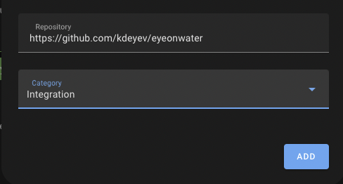
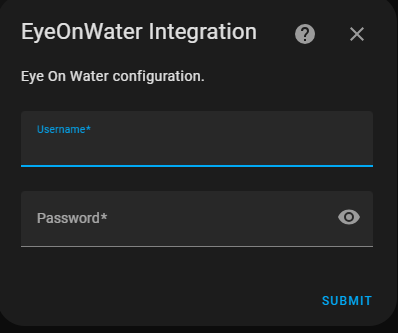
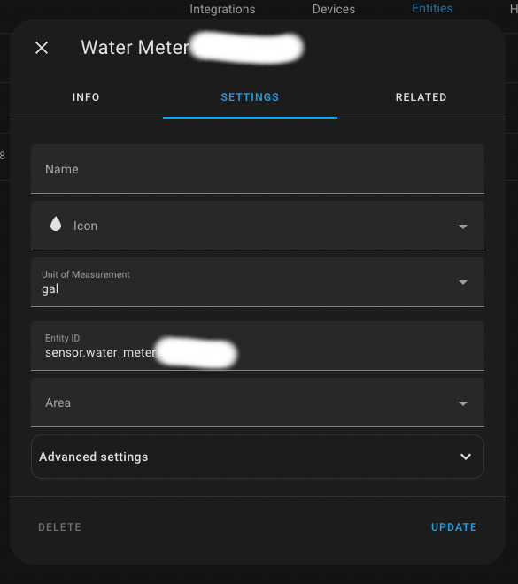
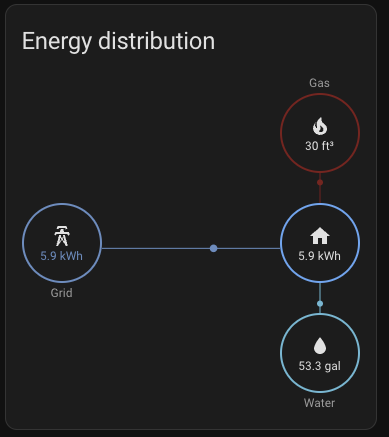
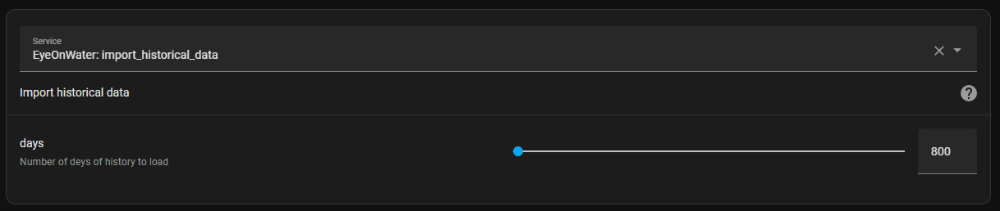

# Home Assistant integration for EyeOnWater service

1. Follow [instruction](https://hacs.xyz/docs/faq/custom_repositories/) for adding a custom git repository to your HA.

Add `https://github.com/kdeyev/eyeonwater` as Repository and select the `Integration` category.



1. Add EyeOnWater integration following [HACS instructions](https://github.com/hacs/integration)

Follow the configuration dialog and use your username and password, which you use to log in on eyeonwater.



1. After successful initialization you should see the integration card appear:





1. Got to `Settings`->`Dashboards`->`Energy` configuration.

You should be able to choose your water meter in the Water Consumption section.


You may see an error message like: `The state class '' of this entity is not supported.` It's expected, for more details please look at <https://github.com/kdeyev/eyeonwater/issues/30>

1. Have fun and watch your utilities in the Energy Dashboard.



Pay attention that EyeOnWater publishes the meter reading once in several hours (even when they accumulate the meter reading once in several minutes). So data may come with a delay of several hours.

## Import historical data

The integration allows to import of historical water data usage after it was installed.

- Go to `Developer Tools` -> `Services`.
- Enter the `EyeOnWater: import_historical_data` service name.
- Choose how many days of historical data you want to import.
- Pay attention that the import may take some time.



## Service actions

The integration provides additional service actions for diagnostics and maintenance.

- `eyeonwater.replay_scenario`: Replays real API payloads for a date range through the statistics pipeline.
- `eyeonwater.validate_statistics_monotonic`: Validates cumulative sums for monotonicity.
- `eyeonwater.reset_statistics`: Deletes all statistics rows for a meter (requires `confirm=DELETE`).

## Cost Override (per-hour cost attribution)

By default, HA's Energy Dashboard attributes water cost at the time a reading
lands in the state machine — for EyeOnWater this means cost is lumped at
delivery time rather than spread across the hours when water was actually consumed.

The **Cost Override** option enables per-hour cost statistics that are imported
directly into LTS alongside consumption data, giving accurate retroactive cost
attribution even for backfilled or delayed readings.

To enable it, go to **Settings → Devices & Services → EyeOnWater → Configure**
and set the **Price entity** field to a sensor whose state is your water rate
in currency-per-gallon (e.g. `sensor.current_water_rate`).

See [docs/CUSTOM_COST_OPTION.md](docs/CUSTOM_COST_OPTION.md) for full setup
instructions, Energy Dashboard wiring, and caveats.

## Unsupported state class

Please pay attention: If you look at the `Developer Tools` -> `Statistics`, you will see an error message associated with the water sensor:

```text
The state class '' of this entity is not supported.
```

or

```text
Unsupported state class
The state class of this entity, is not supported.
Statistics cannot be generated until this entity has a supported state class.

If this state class was provided by an integration, this is a bug. Please report an issue.

If you have set this state class yourself, please correct it. The different state classes and when to use which can be found in the developer documentation. If the state class has permanently changed, you may want to remove the long term statistics of it from your database.

Do you want to permanently remove the long term statistics of sensor.water_meter_200010108 from your database?
```

It is a side-effect of how Home Assistant handles statistics for this integration. You can find more information in [issue #30](https://github.com/kdeyev/eyeonwater/issues/30).

## Developer Documentation

| Document | Description |
| -------- | ----------- |
| [docs/DEVELOPER_GUIDE.md](docs/DEVELOPER_GUIDE.md) | Developer guide: HA statistics model, sensor design, statistics import pipeline, coordinator cycle, developer services, test suite |
| [docs/CUSTOM_COST_OPTION.md](docs/CUSTOM_COST_OPTION.md) | Cost Override option: per-hour cost attribution via companion LTS stat, price entity setup, Energy Dashboard wiring, caveats |
