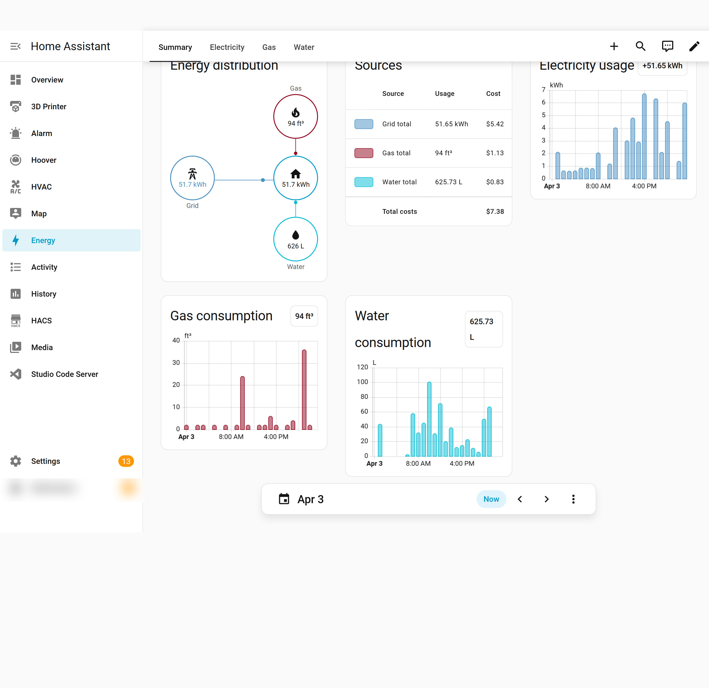

# Home Assistant integration for EyeOnWater

Track your **water usage** directly in Home Assistant using the [EyeOnWater](https://eyeonwater.com) service. This integration imports accurate hourly meter readings into HA's Energy Dashboard — including **historical data** and optional **cost tracking**.

### Key Features

- **Energy Dashboard integration** — hourly water consumption statistics with full history
- **Water cost tracking** — multiply usage by your unit price for cost statistics
- **Historical data import** — backfill days/weeks/months of data on demand
- **Diagnostic sensors** — temperature, flow, battery, and signal strength
- **US & Canada support** — works with `eyeonwater.com` and `eyeonwater.ca`

## Quick Start

1. Add this repository to [HACS](https://hacs.xyz/docs/faq/custom_repositories/) as a custom integration.
2. Install **EyeOnWater** from HACS → restart Home Assistant.
3. Go to **Settings → Devices & Services → Add Integration → EyeOnWater** and enter your credentials.
4. Add the `eyeonwater:water_meter_xxxxx` statistic to your **Energy Dashboard**.

See the [Installation guide](docs/installation.md) and [Configuration guide](docs/configuration.md) for detailed steps with screenshots.

## 📖 Documentation

| Guide | Description |
|-------|-------------|
| [Installation](docs/installation.md) | Install via HACS or manually |
| [Configuration](docs/configuration.md) | Set up credentials, sensors, and options |
| [Energy Dashboard](docs/energy-dashboard.md) | Add water consumption to HA Energy |
| [Historical Data & Architecture](docs/historical-data.md) | Import past data — how retroactive statistics work |
| [Water Cost Tracking](docs/cost-tracking.md) | Track water costs in the Energy Dashboard |
| [Upgrading to v2.6](docs/migration-v2.6.md) | Breaking changes and migration steps |
| [Troubleshooting](docs/troubleshooting.md) | Common issues and solutions |

## How It Works

This integration uses Home Assistant's **external statistics** API to import accurate hourly water data from EyeOnWater under a dedicated `eyeonwater:` namespace:

| Component | ID | Purpose |
|---|---|---|
| Live sensor | `sensor.water_meter_xxxxx` | Real-time meter reading |
| Water statistic | `eyeonwater:water_meter_xxxxx` | Energy Dashboard — hourly usage |
| Cost statistic | `eyeonwater:water_cost_xxxxx` | Energy Dashboard — hourly cost |

The live sensor has no `state_class`, so HA does not auto-compile statistics for it — all data flows through external statistics, avoiding the [negative-value spikes](https://github.com/kdeyev/eyeonwater/issues/30) caused by retroactive imports.

## Contributing

See [CONTRIBUTING.md](CONTRIBUTING.md) for development setup and guidelines.
