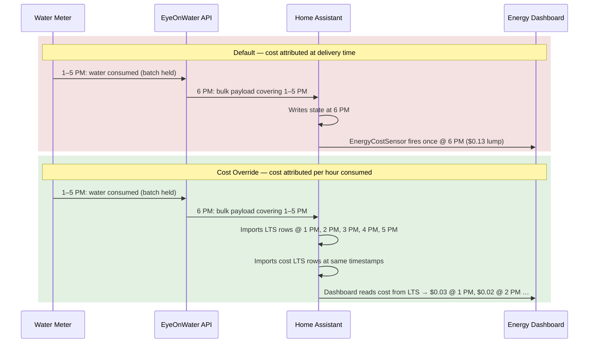
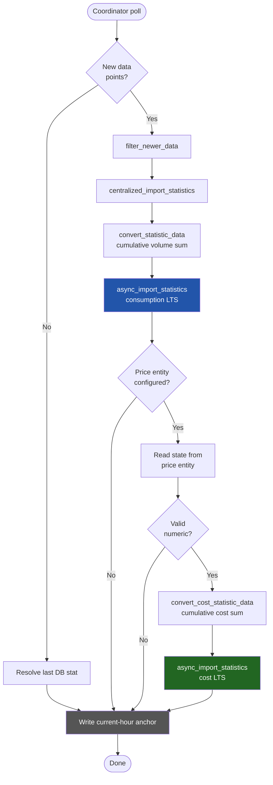
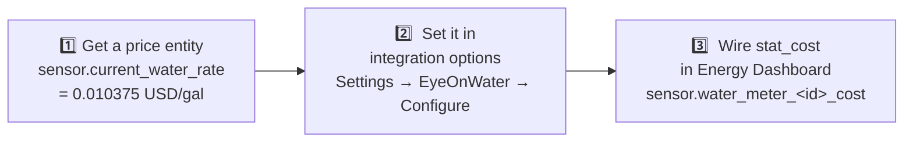

# Cost Override Option

## Overview

By default, the EyeOnWater integration lets Home Assistant generate water cost
automatically via the Energy Dashboard's built-in tariff system.  That works
well when data arrives in real time — HA multiplies the new meter reading by
the configured tariff and attributes the cost to the moment the state changes.

**The problem:** EyeOnWater publishes readings in batches, typically hours
after the water was consumed.  When a bulk payload arrives at, say, 6:00 PM
covering hourly readings from 1:00 PM–5:00 PM, HA's auto-cost sensor fires
once at 6:00 PM and lumps the entire cost there.  The Energy Dashboard shows a
single cost spike at delivery time instead of spreading the cost across the
hours when the water was actually used.

The **Cost Override** option fixes this by computing per-hour costs inside the
integration at import time and writing them directly into the Home Assistant
long-term statistics (LTS) database alongside the consumption data.  Because
both consumption and cost land in LTS at the same timestamps, the Energy
Dashboard displays accurate per-hour cost bars — including for backfilled or
retroactively imported data.



---

## How It Works

When a price entity is configured, every import (live poll, manual
`import_historical_data` service call, or `replay_scenario` service call) also
imports a companion cost LTS statistic:

```python
sensor.water_meter_<meter_id>_cost
```

This statistic accumulates cost the same way the consumption statistic
accumulates volume — it is a cumulative running total in your local currency.

The Energy Dashboard reads both statistics via the same
`statistics_during_period` LTS query, so per-hour cost attribution is correct
even for data that arrived late or was backfilled months in the past.

HA's built-in `EnergyCostSensor` (the one that fires on state changes) is
effectively bypassed for cost display once you point the Energy Dashboard's
`stat_cost` field at the companion statistic.



---

## Setup



### 1. Identify your price entity

You need a Home Assistant sensor whose **state** is the current water rate in
your local **currency per gallon** (or per the native unit of your meter).

Examples of suitable entities:

- A template sensor you maintain manually
- An `input_number` helper
- A sensor populated automatically from a rate management script (e.g. the
  `sensor.current_water_rate` entity shown below)

The state at the time of each import is captured and applied to every data
point in that import batch.  If your rate changes, trigger a
`reimport_historical_data` service call for the affected period to rewrite
those cost rows with the new rate (see [Caveats](#caveats)).

### 2. Set the price entity in the integration options

1. Go to **Settings → Devices & Services → EyeOnWater**.
2. Click **Configure** on the integration card.
3. In the **Price entity (currency/gal)** field, enter the entity ID of your
   price sensor — e.g. `sensor.current_water_rate`.
4. Click **Submit**.

The integration logs a confirmation at startup:

```log
Cost statistics enabled for meter 60439875 using price entity
'sensor.current_water_rate'.
Set stat_cost: sensor.water_meter_60439875_cost in your Energy Dashboard
water source config.
```

### 3. Wire the cost statistic into the Energy Dashboard

1. Go to **Settings → Dashboards → Energy**.
2. In the **Water consumption** section, click the gear icon next to your water
   meter.
3. Set the **Monthly fixed cost** and/or **Use an entity with current price**
   fields to *None* (clear them) so HA's auto-cost sensor does not interfere.
4. To enable the custom cost stat, you currently need to edit your HA
   `configuration.yaml` directly (**the UI does not yet expose `stat_cost`**):

```yaml
# configuration.yaml  (energy dashboard overrides)
homeassistant:
  customize: {}

# Energy source override — add stat_cost to your water source
# The exact key depends on your HA version; find it under:
#   Developer Tools → Template → {{ states | ... }}
# or patch it via the energy_prefs storage entry.
```

> **Note:** As of early 2026 the Energy Dashboard UI does not expose a
> `stat_cost` field for water sources.  The workaround is to edit the
> `.storage/energy` file directly (while HA is stopped) or use a custom
> `energy_prefs` REST call.  See [HA issue #XXXXX] for tracking.
>
> Once the UI exposes it, you simply set:
>
> - **Use a statistic for cost** → `sensor.water_meter_<meter_id>_cost`

---

## Verification

After the next coordinator poll (or a manual `import_historical_data` call)
you can verify the cost statistic was created:

1. **Developer Tools → Statistics** — search for
   `sensor.water_meter_<meter_id>_cost`.  It should appear with unit `USD`
   (or your local currency) and no issues.
2. **Developer Tools → Template** — query recent values:

```jinja
{{ states('sensor.current_water_rate') }}
```

1. **Home Assistant logs** — look for:

```log
Imported N cost statistics for sensor.water_meter_60439875_cost
(rate=0.010375 USD/unit, range: 2026-02-19T13:00:00 to 2026-02-19T17:00:00)
```

---

## Default Behavior (Without This Option)

When no price entity is configured the integration behaves identically to
prior versions:

- Only consumption LTS statistics are imported.
- HA's built-in `EnergyCostSensor` is used if a tariff is configured in the
  Energy Dashboard.
- Cost is attributed at the time the reading lands in HA's state machine
  (delivery time), not at the time water was consumed.

This is the simpler path and is perfectly sufficient for users who do not need
per-hour cost accuracy or who pay a flat monthly rate.

---

## Caveats

| Concern | Detail |
| --- | --- |
| **Price is sampled at import time** | The rate is read from the price entity at import time and applied to every data point in that run.  Historical imports use the *current* rate, not the rate that was in effect at the time of consumption. |
| **Price changes** | If your rate changes, re-run `eyeonwater.import_historical_data` (or `eyeonwater.replay_scenario`) to overwrite the affected cost rows with the new rate.  Consumption rows are unaffected. |
| **UI not yet supported** | The `stat_cost` field for water sources is not exposed in the Energy Dashboard UI as of HA 2026.x.  Direct storage editing or a REST API call is required to point the dashboard at the companion stat. |
| **Currency unit** | The companion statistic is created with the unit from `hass.config.currency` (defaults to `USD`).  This must match the currency configured in your HA system settings or the Energy Dashboard will reject it. |
| **Backfill accuracy** | Cost backfill reuses the same overlap-detection logic as consumption: the tool finds the last cost row before the first import point and continues from there, preventing double-counting. |

---

## Example: Missouri American Water

The following setup is used by the integration author to drive automatic rate
updates from the Missouri American Water published tariff PDF:

```yaml
# /config/packages/amwater.yaml
sensor:
  - platform: template
    sensors:
      current_water_rate:
        friendly_name: "Current Water Rate"
        unit_of_measurement: "USD/gal"
        icon_template: mdi:cash
        value_template: >
          
          {{ (rate_per_100_gal / 100) | round(6) }}
        attribute_templates:
          rate_per_100_gal: "{{ states('input_number.amwater_mo_stl_rate_per_100_gal') }}"
```

The `input_number.amwater_mo_stl_rate_per_100_gal` is updated monthly by a
shell script that downloads and parses the current tariff PDF.  The template
sensor converts the per-100-gallon rate to a per-gallon rate which the
integration reads directly.

With this setup:

- **Price entity:** `sensor.current_water_rate` (state: `0.010375` USD/gal)
- **Companion stat:** `sensor.water_meter_60439875_cost`
- Every import run correctly attributes e.g. `13 gal × $0.010375 = $0.13` to
  the 1:00 PM hour, `7 gal × $0.010375 = $0.07` to the 2:00 PM hour, etc.

---

## Summary

| Mode | Cost attribution | Backfill support | Setup |
| --- | --- | --- | --- |
| **Default (HA auto-cost)** | At delivery time (state change) | No | Choose tariff in Energy Dashboard |
| **Cost Override** | At consumption time (per-hour LTS) | Yes | Configure price entity → set `stat_cost` |
