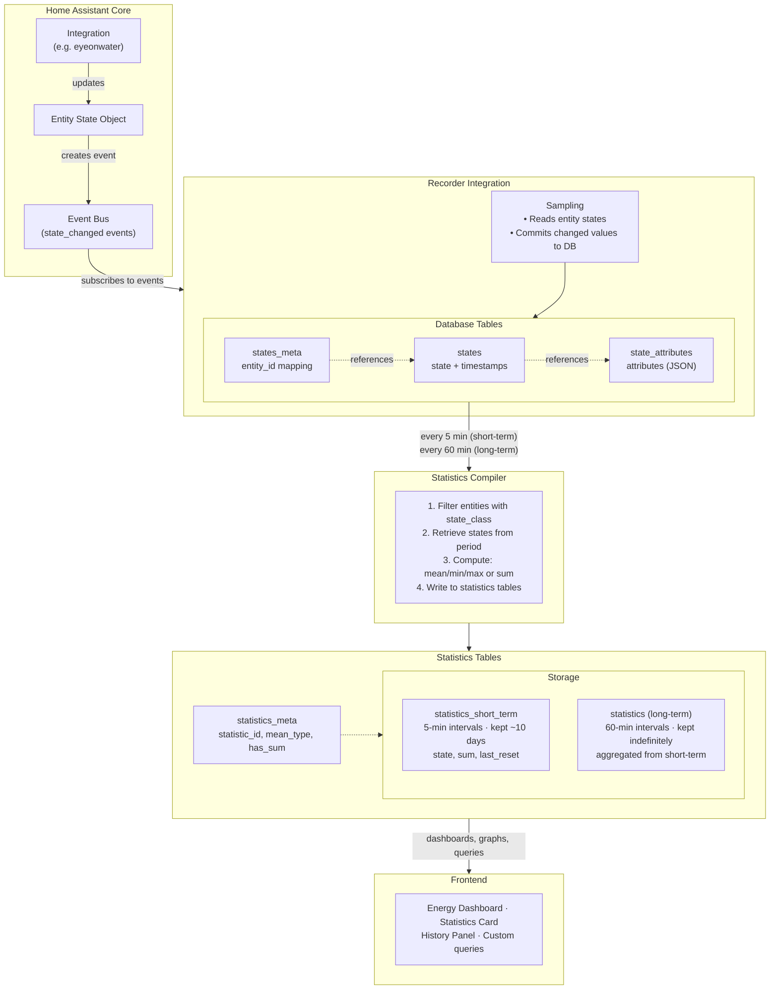
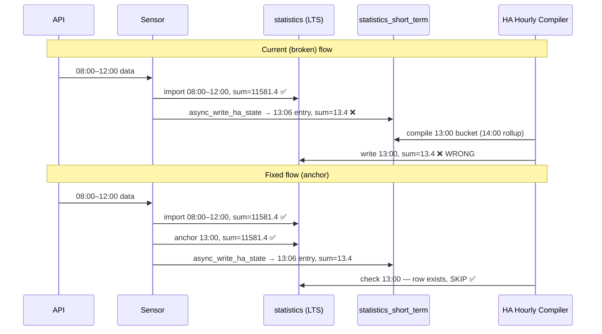

# eyeonwater Developer Guide

**Repository:** [kdeyev/eyeonwater](https://github.com/kdeyev/eyeonwater)
**Integration purpose:** Home Assistant custom component for [EyeOnWater](https://eyeonwater.com/) residential water meters.

---

## Table of Contents

1. [Architecture Overview](#1-architecture-overview)
2. [Home Assistant Statistics: The Three-Layer Model](#2-home-assistant-statistics-the-three-layer-model)
3. [Sensor Design: One Sensor vs. Two Sensors](#3-sensor-design-one-sensor-vs-two-sensors)
4. [Statistics Import Pipeline](#4-statistics-import-pipeline)
5. [Developer Services](#5-developer-services)
6. [ConfigFlow: The Metaclass Pattern](#6-configflow-the-metaclass-pattern)
7. [Coordinator and Update Cycle](#7-coordinator-and-update-cycle)
8. [Dependency and Environment Notes](#8-dependency-and-environment-notes)
9. [Test Suite](#9-test-suite)

---

## 1. Architecture Overview

```text
custom_components/eyeonwater/
├── __init__.py             Integration setup, service registration, coordinator wiring
├── config_flow.py          UI-driven setup/options flow (ConfigFlow + OptionsFlow)
├── const.py                All constants: intervals, names, service names
├── coordinator.py          EyeOnWaterData — meter polling, concurrent reads
├── sensor.py               EyeOnWaterUnifiedSensor — entity state + statistics trigger
├── binary_sensor.py        Condition sensors (leak, tamper, etc.)
├── statistic_helper.py     Statistics import logic: convert, import, query last values
├── statistics_tools.py     Maintenance: reset_statistics, validate_monotonic_sums
├── services.yaml           Service definitions for the HA UI
└── manifest.json           Integration manifest (version, dependencies)
```

### Data Flow

```text
EyeOnWater API
      ↓  (every 15 min via SCAN_INTERVAL)
EyeOnWaterData.read_meters()          ← coordinator.py
      ↓
Meter.last_historical_data            ← pyonwater.Meter
      ↓
EyeOnWaterUnifiedSensor._state_update()   ← sensor.py
      ↓  if new data since last import
centralized_import_statistics()       ← statistic_helper.py
      ↓
async_import_statistics()             ← HA recorder API
      ↓
statistics table (PostgreSQL/SQLite)
```

---

## 2. Home Assistant Statistics: The Three-Layer Model

Understanding this model is prerequisite to working on anything in `statistic_helper.py`.

> Diagram adapted from [DrCoolzic/ha-statistics-doc](https://github.com/DrCoolzic/ha-statistics-doc/blob/main/README.md).



```text
Layer 1 — Entity State
  Updated only when the API delivers a fresh data chunk (a few times/day).
  Holds the last point of the new batch as native_value.
  state_class = SensorStateClass.TOTAL_INCREASING  ← required for Energy Dashboard
  Used by: automations, template sensors, the entity card in the UI.
  NOT written on stale 15-minute polls (no new API data = no state write).

Layer 2 — Short-Term Statistics (statistics_short_term table)
  Auto-populated by HA's recorder from Layer 1 state changes.
  Only written when entity state is written (i.e., when new data arrived).
  Retained for approximately 2 weeks.
  Used by: the "history" graph in the entity detail view.

Layer 3 — Long-Term Statistics (statistics table)
  Stores per-hour aggregates.
  Retained indefinitely.
  Written DIRECTLY via async_import_statistics() for historical hours.
  Auto-rolled up from Layer 2 for the current hour.
  Used by: the Energy Dashboard, statistics developer tools, cost calculation.
```

**The critical capability:** `async_import_statistics()` accepts backdated timestamps. This means the integration can inject an entire year of hourly readings in a single service call, writing directly to Layer 3 without modifying the current entity state or interfering with the live 15-minute update cycle.

### The Two Required Fields

Every `StatisticData` row requires both:

| Field | Meaning | Example value |
| ----- | ------- | ------------- |
| `state` | Absolute meter odometer reading at this hour | `203,444.9` (gal) |
| `sum` | Cumulative consumption since HA tracking began | `59,549.4` (gal) |

HA uses `state` to display the current entity value in statistics views. HA uses `sum` to compute per-period consumption for the Energy Dashboard (plotted as `sum[hour_n] - sum[hour_n-1]`). Both must be correct simultaneously. Getting only one right produces one of two wrong behaviors:

- Correct Energy Dashboard bars, wrong entity value in history
- Correct entity value, wrong/absent energy consumption data

### `StatisticMetaData` Requirements (HA 2026.2+)

```python
from homeassistant.components.recorder.models import StatisticMeanType

StatisticMetaData(
    has_mean=False,
    has_sum=True,
    name="Water Meter 60439875",
    source="recorder",
    statistic_id="sensor.water_meter_60439875",
    unit_of_measurement="gal",           # string value, NOT UnitOfVolume enum object
    mean_type=StatisticMeanType.NONE,    # Required as of HA 2026.2; replaces has_mean bool
    unit_class="volume",                 # Enables HA unit conversion support
)
```

> **Silent failure:** If `unit_of_measurement` receives a `UnitOfVolume` enum object instead of its `.value` string, HA's recorder silently drops all inserts for that metadata ID with no error or warning.

---

## 3. Sensor Design: One Sensor vs. Two Sensors

### The Upstream Two-Sensor Design

The original integration (upstream `kdeyev/eyeonwater`) was designed with two entities per meter as an intentional workaround for a Home Assistant statistics behavior:

- **`sensor.water_meter_{id}`** — Live reading entity, no `state_class`. Updated by coordinator. Used for automations.
- **`sensor.water_meter_{id}_statistic`** — Statistics-only entity with `state_class = TOTAL_INCREASING`. Never displays in the UI as a useful sensor but powers the Energy Dashboard.

**Why two sensors?** `SensorStateClass.TOTAL_INCREASING` causes HA to auto-generate statistics from every state change the recorder observes. When the coordinator polls every 15 minutes, each 15-minute reading becomes a short-term statistic. These auto-rollup into long-term statistics at the top of each hour. The problem: if the coordinator misses a poll or the integration restarts, HA interprets the next higher reading as a "consumption of (new_value - 0)" because it lost the previous baseline — producing phantom usage spikes.

### The Single-Sensor Architecture

- **`EyeOnWaterUnifiedSensor`** — One entity per meter that owns both the live state and the statistics import.
- `state_class = SensorStateClass.TOTAL_INCREASING` — **required** for the Energy Dashboard to (a) allow the entity to appear in its Water source picker, and (b) calculate cost-per-unit against configured tariff rates.
- Statistics are written via `centralized_import_statistics()` → `async_import_statistics()` (historical backfill and incremental updates), **plus** HA's own auto-generated `statistics_short_term` entries from selective entity state writes.

**Why `TOTAL_INCREASING` is non-negotiable:**

Without `state_class = TOTAL_INCREASING`, HA does not register the entity as a countable consumable. The Energy Dashboard will show statistics bars (because the `statistics` table has data) but the cost column will always be blank — HA never runs the price-per-volume calculation step. This is verified behavior, not theoretical: removing `state_class` broke cost tracking in production.

**The two-path statistics architecture:**

- **`async_import_statistics()`** — triggered when new API data arrives; writes directly to `statistics` (hourly LTS). Used for historical backfill and incremental fill of completed hours.
- **HA recorder auto-compile** — triggered by `async_write_ha_state()`; writes to `statistics_short_term`, which rolls up to `statistics` at the top of each hour. Used for real-time tracking of the current/recent hour.

For historical hours (before the current hour), only the first path writes. There are no `statistics_short_term` entries for those hours, so no conflict. For the current/recent hour, both paths may write. The hourly rollup uses the last `statistics_short_term` entry's `state` and `sum` for that period. As long as the sum chain in `statistics_short_term` is unbroken, both paths produce the same values.

**The mandatory guard — only write state when new data arrives:**

HA computes `sum` in `statistics_short_term` automatically as `previous_short_term_sum + (current_state - previous_short_term_state)`. If `async_write_ha_state()` is called on every 15-minute coordinator poll (even when no new API data arrived), HA emits a `statistics_short_term` entry with the same reading value but a different timestamp. For an unchanging reading, the delta is 0 and the `sum` is correct. **However**, repeated identical-value writes create noise:

- Stale polls → no write: `async_write_ha_state()` is skipped when `filter_newer_data` returns 0 new points.
- New data → state write: the last point of the fresh batch is written as entity state. HA generates one correct `statistics_short_term` entry for that timestamp.

This keeps `statistics_short_term` sparse (a few entries per day) and always reflecting real meter readings.

**Known risk condition — sum chain break after purge:**

If `recorder.purge_entities` (or the `reset_statistics` service) is called:

1. HA loses its `statistics_short_term` sum baseline for the entity.
2. The **next** `async_write_ha_state()` call causes HA to emit a `statistics_short_term` entry where `sum ≈ 0` (first entry after reset: `sum = current_state - initial_state`, initial = current, delta = 0).
3. At the next hourly rollup boundary, HA UPSERTs this `sum ≈ 0` row into `statistics`, **overwriting** the correctly-imported sum for that hour.
4. This produces a large negative delta in the Energy Dashboard for that hour.

**Resolution after any purge/reset:** immediately call `import_historical_data` (or `replay_scenario`) **before** the next hourly rollup boundary to re-establish correct `statistics` values. The short-term sum chain will self-correct on the first new state write that follows correct statistics.

**Operational note:** The purge-then-contamination sequence is a maintenance/development operation, not a normal production failure mode. In steady-state operation the sum chain is never broken.

**Known risk condition — HA hourly compiler timing (production failure mode):**

HA's hourly statistics compiler runs at the top of each hour, independent of the coordinator's 15-minute poll cycle. If the compiler runs while the `statistics_short_term` table is empty or contaminated (e.g. after a recorder restart, HA restart, or any gap in short-term entries), the following sequence produces a negative Energy Dashboard bar:

1. Compiler runs, finds no valid `statistics_short_term` entries since the last LTS row → sets its in-memory `_prev_states[statistic_id] = {sum: 0, state: <last_reading>}`.
2. Coordinator poll arrives; `centralized_import_statistics()` correctly writes historical LTS rows (e.g. `sum = 11,581.4 gal`). ✅
3. `async_write_ha_state(204,333.2)` executes. HA creates a `statistics_short_term` entry using the **stale in-memory sum chain**: `sum = 0 + (204,333.2 − 204,319.8) = 13.4`. ❌
4. At the next hourly rollup, HA compiles that short-term entry → writes `sum = 13.4` to `statistics`. Energy Dashboard bar = `13.4 − 11,581.4 = −11,568 gal`. ❌

This is a **production failure mode**, not limited to manual purge/reset operations. It can occur any time HA's recorder restarts or the short-term sum chain is interrupted.

**Fix — current-hour LTS anchor:** `centralized_import_statistics()` writes one additional LTS row ("anchor") for the current hour bucket immediately after importing historical data (only when `current_hour > last_import_hour`). HA's hourly compiler **unconditionally skips** any hour bucket that already has an LTS row — so after the anchor is written, the stale in-memory sum chain cannot produce a wrong LTS row for that bucket.



```python
# statistic_helper.py — anchor logic (simplified)
last_import_hour = statistics_dicts[-1]["start"].replace(minute=0, second=0, microsecond=0)
current_hour = dtutil.now().replace(minute=0, second=0, microsecond=0)
if current_hour > last_import_hour:
    anchor_state = float(last_imported.get("state") or 0.0)
    anchor_sum   = float(last_imported.get("sum")   or 0.0)
    async_import_statistics(hass, metadata,
        [{"start": current_hour, "state": anchor_state, "sum": anchor_sum}])
```

The anchor carries the same `state`/`sum` as the last imported data point. When real API data for that hour arrives in a subsequent poll, `async_import_statistics()` upserts the correct values in place — the anchor is seamlessly replaced with no manual cleanup required.

**LTS/states chart boundary artifact:**

HA's history chart blends two data sources for any date within the state retention window (default 10 days):

- **Long-term statistics (`statistics` table):** hourly bucket values written by `async_import_statistics()`
- **State history (`states` table):** sub-hourly real-time writes produced by `async_write_ha_state()`

When `import_historical_data` is run against a period that still has recent states (e.g., re-importing yesterday's data), the chart can render a visual "dip": the 5 PM LTS bucket shows 204,281.9 gal, but a 5:56 PM state entry shows 204,278.7 gal — 3.2 gal lower, creating a backward-going line from the LTS point to the state point.

The underlying data is correct; the artifact is purely visual, caused by the chart joining two sources at slightly different timestamps.

**Resolution:** pass `purge_states: true` to `import_historical_data`. This calls `recorder.purge_entities(keep_days=0)` after the import, removing all state rows for the entity. The chart then renders purely from LTS for historical periods. New state writes accumulate normally after the purge and the artifact cannot re-appear for those newly-clean periods.

### ID Naming: `meter_uuid` vs `meter_id`

These are different identifiers and the distinction matters for service calls:

| Identifier | Source | Used for | Example |
| ---------- | ------ | -------- | ------- |
| `meter_uuid` | Hardware serial, from API | Entity unique ID → entity_id | `sensor.water_meter_5215777958325016766` |
| `meter_id` | Account/billing ID, from API | Statistics ID → statistic_id | `sensor.water_meter_60439875` |

```python
# From sensor.py:
self._attr_unique_id = normalize_id(meter.meter_uuid)   # → entity uniqueness
self._statistic_id = get_entity_statistic_id(meter.meter_id)  # → statistics table key
```

When calling services (e.g., `reset_statistics`, `validate_statistics_monotonic`), use the **meter_id** form (`sensor.water_meter_60439875`), not the UUID form.

---

## 4. Statistics Import Pipeline

All statistics writes go through `statistic_helper.py`. This is the single source of truth for the import logic.

### `convert_statistic_data()`

Converts a list of `DataPoint` objects into `StatisticData` dicts ready for HA import.

```python
def convert_statistic_data(
    data: Sequence[DataPoint],
    *,
    last_sum: float | None = None,
    last_reading: float | None = None,
) -> list[StatisticData]:
```

**The continuity contract:** `last_sum` and `last_reading` must come from the most recent row in the statistics database (queried via `get_last_imported_stat()`). Without them, the first imported point is treated as if it follows a zero reading — producing a massive spike equal to the meter's total lifetime consumption.

**Monotonic enforcement:** `enforce_monotonic_total()` (from pyonwater's `series.py`) is called before the delta loop. This clamps any reading that is lower than the previous to the previous value.

**The delta loop:**

```text
for each point:
    delta = point.reading - previous_reading
    cumulative_sum += delta
    yield StatisticData(start=point.dt, state=point.reading, sum=cumulative_sum)
    previous_reading = point.reading
```

### `get_last_imported_stat()`

Queries the HA statistics database for the most recent row for a given `statistic_id`. Returns `(last_datetime, last_state, last_sum)`.

This query must be run on each import to establish the continuation baseline. Caching this value (e.g., storing it in sensor instance state) leads to dual-write conflicts when multiple code paths attempt to import simultaneously.

### `centralized_import_statistics()`

The top-level function called by both the sensor's update path and the service handler:

1. Calls `get_last_imported_stat()` to get the DB anchor
2. Calls `filter_points_after()` to skip already-imported points
3. Calls `convert_statistic_data()` with the DB anchor as baseline
4. Calls `async_import_statistics()` with the resulting rows
5. Writes a **current-hour LTS anchor row** when `current_hour > last_import_hour` — prevents HA's hourly compiler from using a stale in-memory sum chain for the current hour bucket (see §3 "Known risk condition — HA hourly compiler timing")
6. Returns the count of rows imported

### Concurrency Protection

Each `EyeOnWaterUnifiedSensor` holds a per-meter `asyncio.Lock`. The lock is acquired before `centralized_import_statistics()` and prevents concurrent import of the same meter's data:

```python
# sensor.py
self._import_lock = asyncio.Lock()

async def _handle_update_async(self, latest_data):
    if self._import_lock.locked():
        _LOGGER.debug("Import already in progress for meter %s — skipping", self._id)
        return
    async with self._import_lock:
        await centralized_import_statistics(...)
```

### `async_import_statistics` — Important Calling Convention

Despite its `async_` prefix, this function is **not a coroutine**. It is a synchronous function that is safe to call from an async context (HA's naming convention for thread-safe-from-async functions):

```python
# CORRECT
async_import_statistics(hass, metadata, statistics_list)

# WRONG — raises TypeError
await async_import_statistics(hass, metadata, statistics_list)
```

### Post-Import Visibility Delay

After calling `async_import_statistics()`, the written statistics are not immediately visible to `get_last_statistics()`. The recorder processes the import asynchronously. A brief `asyncio.sleep()` or an explicit coordinator refresh is required before querying the DB to confirm the import:

```python
async_import_statistics(hass, metadata, stats)
await asyncio.sleep(0.5)
await coordinator.async_request_refresh()
```

---

## 5. Developer Services

The integration registers four HA services accessible via **Settings > Developer Tools > Services**.

### `eyeonwater.import_historical_data`

Fetches historical readings from the EyeOnWater API and writes them to HA's long-term statistics.

```yaml
service: eyeonwater.import_historical_data
data:
  days: 365           # How many days back from today (default: 365, max: 730)
  force_overwrite: false   # If true, re-imports data even if already present
  purge_states: false      # If true, purge entity state history after import
```

**Behavior:** Reads `days` days of HOURLY data, runs through `centralized_import_statistics()`, optionally purges entity state history, then triggers a coordinator refresh.

**`purge_states` flag:** After a successful import, calls `recorder.purge_entities(keep_days=0)` for each meter entity. This eliminates the LTS/states chart boundary artifact (see §3 above). Use when backfilling or re-importing data that overlaps with the current state retention window. Safe — LTS covers all historical display and Energy Dashboard needs. New state writes accumulate normally after the purge.

**Limitation (current):** The date range is always `today - days` → `today`. Date-specific ranges require a pyonwater version newer than 0.3.17.

### `eyeonwater.replay_scenario`

Advanced debugging service. Fetches real API payloads for a specific date range and replays them through the same statistics pipeline as the live coordinator.

```yaml
service: eyeonwater.replay_scenario
data:
  entity_id: sensor.water_meter_60439875   # or use meter_id
  start_date: "2026-02-01T00:00:00"
  end_date: "2026-02-14T00:00:00"
  aggregation: "HOURLY"                    # HOURLY only; WEEKLY/MONTHLY restricted
```

**Restriction:** Only `HOURLY` aggregation is currently permitted in production. Other levels are restricted because importing multiple aggregation levels for the same period creates overlapping timestamps, which produce negative consumption bars in the Energy Dashboard.

**Datetime fields:** HA's `datetime` selector sends naive `datetime` objects (no timezone). The service handler converts them to the HA instance's configured timezone:

```python
if isinstance(start_date, datetime) and start_date.tzinfo is None:
    start_date = start_date.replace(tzinfo=zoneinfo.ZoneInfo(hass.config.time_zone))
```

### `eyeonwater.validate_statistics_monotonic`

Reads all statistics rows for a meter and reports any violation of the monotonic constraint (sum decreases between hours). Used to diagnose negative consumption bars in the Energy Dashboard.

```yaml
service: eyeonwater.validate_statistics_monotonic
data:
  statistic_id: sensor.water_meter_60439875   # or use entity_id or meter_id
```

Returns a log entry with violation count, indices, and delta values.

### `eyeonwater.reset_statistics`

Deletes all long-term and short-term statistics for a meter. Requires explicit confirmation.

```yaml
service: eyeonwater.reset_statistics
data:
  statistic_id: sensor.water_meter_60439875
  confirm: true    # Required; prevents accidental deletion
```

> **Important:** Both the `statistics` table AND the `statistics_short_term` table must be cleared. Deleting only `statistics` leaves short-term rows that HA's recorder will roll back up into new long-term statistics — propagating any corruption forward. `delete_statistics()` in `statistics_tools.py` handles both tables.

---

## 6. ConfigFlow: The Metaclass Pattern

The `ConfigFlow` class definition uses a Python metaclass keyword argument that is architecturally required and must not be changed:

```python
class ConfigFlow(config_entries.ConfigFlow, domain=DOMAIN):  # type: ignore[call-arg]
    """Handle a config flow for EyeOnWater."""
    VERSION = 1
```

**Why `domain=DOMAIN` must be a keyword argument (not a class attribute):**

Home Assistant's `ConfigFlow` base class uses a Python metaclass that intercepts class creation via `__init_subclass__`. The `domain=` argument is consumed by this metaclass at class-definition time to register the integration's config flow handler with HA's flow manager.

If `domain=DOMAIN` is moved to a class body attribute:

```python
# WRONG — the metaclass never sees this assignment
class ConfigFlow(config_entries.ConfigFlow):
    domain = DOMAIN   # This runs after metaclass registration; flow is never registered
```

HA silently creates an orphaned config entry with no handler. The resulting user-visible error is "Integration 'eyeonwater' not found" or a config entry that cannot complete setup.

**Why `# type: ignore[call-arg]`:** Python's type stubs for `config_entries.ConfigFlow` do not model the metaclass `__init_subclass__` signature. The type checker sees `domain=DOMAIN` as an unexpected keyword argument. This comment is not suppressing a code smell — it documents a deliberate bypass of an incomplete type stub.

---

## 7. Coordinator and Update Cycle

### Polling Interval

```python
SCAN_INTERVAL = timedelta(minutes=15)   # const.py
```

The coordinator refreshes every 15 minutes, matching the meter's hardware read frequency. Each refresh calls `EyeOnWaterData.read_meters(days_to_load=3)`.

### Concurrent Meter Reads

Multiple meters are read concurrently:

```python
tasks = [self._read_single_meter(meter, days_to_load) for meter in meters_snapshot]
await asyncio.gather(*tasks)
```

This matters for households with multiple meters — the coordinator does not serialize reads.

### Debouncer

A `Debouncer` with `cooldown=3600` (1 hour) prevents `async_request_refresh()` calls from hammering the API when multiple service calls or state changes occur in rapid succession. The debouncer is configured with `immediate=True` so the first call within the window executes immediately.

### `EyeOnWaterData` vs `DataUpdateCoordinator`

`EyeOnWaterData` (in `coordinator.py`) owns the API client and meter state. `DataUpdateCoordinator` (built in `__init__.py`) wraps it with HA's update scheduling, error tracking, and entity notification machinery. These are two separate objects:

```python
# __init__.py
eye_on_water_data = EyeOnWaterData(hass, account)
coordinator = DataUpdateCoordinator(
    hass,
    update_method=functools.partial(_async_update_data, eye_on_water_data),
    ...
)
```

Service calls that need to import data call `eye_on_water_data.import_historical_data(...)` (the raw API method), then call `coordinator.async_request_refresh()` (to update the UI).

---

## 8. Dependency and Environment Notes

### Database Backend

This integration supports both SQLite (default HA) and PostgreSQL. All statistics operations use HA's recorder API (`async_import_statistics`, `get_last_statistics`, `async_clear_statistics`), which routes to the correct database automatically.

> Do not write SQL directly against the HA database. The statistics table schema and backend vary between installations. HA's API is the only reliable interface.

### Python Virtual Environment

The development environment uses a `.venv` at `eyeonwater/.venv`. This must be explicitly activated before running pytest:

```bash
cd /home/jshessen/Development/GitHub/eyeonwater
source .venv/bin/activate
python -m pytest tests/ -v
```

The `.venv` is not automatically activated in new terminal sessions or after VS Code restarts.

---

## 9. Test Suite

Tests are in `eyeonwater/tests/`. The suite uses `pytest-homeassistant-custom-component` for HA fixture infrastructure.

### Current Status

| File | Tests | Notes |
| ---- | ----- | ----- |
| `test_const.py` | 8 | Pure unit tests, no HA dependencies |
| `test_imports.py` | 7 | Import validation; uses `ConfigFlow` (not `EyeOnWaterConfigFlow`) |
| `test_statistic_helper.py` | 21 | Full coverage of convert/import/query path |
| `test_statistics_tools.py` | 12 | Both table deletion, monotonic validation |
| `test_coordinator.py` | — | HA async fixtures required |
| `test_sensor.py` | — | HA async fixtures required |
| `test_config_flow.py` | — | HA async fixtures required |

### Running Tests

```bash
source .venv/bin/activate
python -m pytest tests/ -v --tb=short           # All tests
python -m pytest tests/test_statistic_helper.py -v  # Single file
python -m pytest tests/ --cov=custom_components/eyeonwater --cov-report=term-missing
```

### Mock Contract Principle

Mocks for the EyeOnWater API must validate request payloads, not just return canned responses:

```python
# Correct test mock
def mock_api_request(url, **kwargs):
    body = kwargs.get("json", {})
    assert "units" in body, "API contract: 'units' parameter is required"
    return sample_response

# Incorrect — hides missing-parameter bugs
def mock_api_request(url, **kwargs):
    return sample_response   # Returns data regardless of what was sent
```

A mock that returns valid data regardless of request content does not test that the code sends the correct request — it only tests that the code handles the response. The `units` regression (2026) was caused precisely by a test suite that used the incorrect pattern.

### Class Names

The config flow handler is registered as `ConfigFlow` (not `EyeOnWaterConfigFlow`). Tests that import or reference the class must use the correct name:

```python
from custom_components.eyeonwater.config_flow import ConfigFlow  # correct
```
