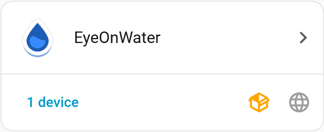
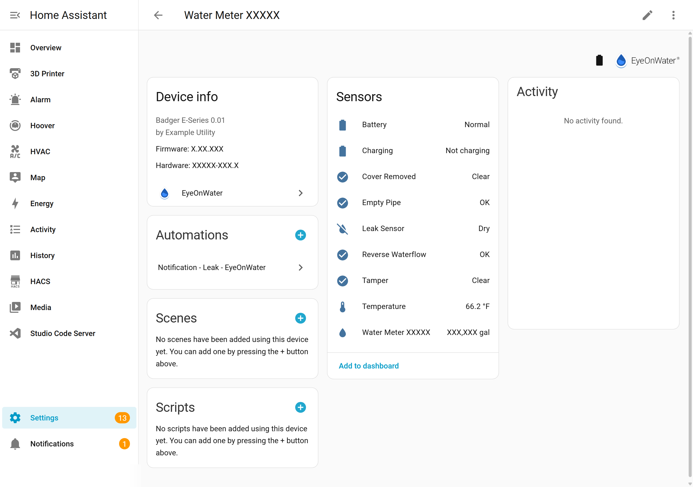

# Configuration

## Adding the Integration

After [installing](installation.md) the integration, add it through the UI:

1. Go to **Settings** → **Devices & Services**.
2. Click **+ Add Integration** and search for **EyeOnWater**.
3. Enter your EyeOnWater credentials — the same email and password you use at [eyeonwater.com](https://eyeonwater.com) or [eyeonwater.ca](https://eyeonwater.ca).

### Automatic detection

The integration reads two settings from your Home Assistant configuration:

| HA Setting | Effect |
|-----------|--------|
| **Country** (`Settings` → `General`) | If set to Canada, the integration uses `eyeonwater.ca` instead of `eyeonwater.com` |
| **Unit System** (`Settings` → `General`) | Switches between metric (liters) and US customary (gallons) |

You don't need to configure these separately — they are picked up automatically.

### What gets created

After successful setup you'll see:

- **1 device** per water meter linked to your EyeOnWater account.
- **1 primary sensor** (`sensor.water_meter_xxxxx`) — the current meter reading.
- **Up to 10 diagnostic sensors** (only when the meter provides the data):

| Sensor | Unit | Description |
|--------|------|-------------|
| Temperature 7-day min | °C | Minimum water temperature over 7 days |
| Temperature 7-day avg | °C | Average water temperature over 7 days |
| Temperature 7-day max | °C | Maximum water temperature over 7 days |
| Temperature latest avg | °C | Latest average temperature reading |
| Usage this week | gal / L | Water used this week |
| Usage last week | gal / L | Water used last week |
| Usage this month | gal / L | Water used this month |
| Usage last month | gal / L | Water used last month |
| Battery level | % | Meter battery percentage |
| Signal strength | dB | Wireless signal strength |

---

## Configuring Water Cost (Options Flow)

You can optionally configure a **unit price** to track water costs in the Energy Dashboard.

1. Go to **Settings** → **Devices & Services** → **EyeOnWater**.
2. Click **Configure** on the integration entry.
3. Enter your **water unit price** — the cost per unit of water (e.g., `0.005` for $0.005 per gallon).
4. Click **Submit**.

The currency is automatically set from your Home Assistant configuration (`Settings` → `General` → `Currency`).

> **Tip:** You can update the unit price at any time. Future imports will use the new price. To recalculate historical costs, use the [import_historical_data service](historical-data.md).

For more details on cost tracking, see the [Water Cost Tracking guide](cost-tracking.md).
