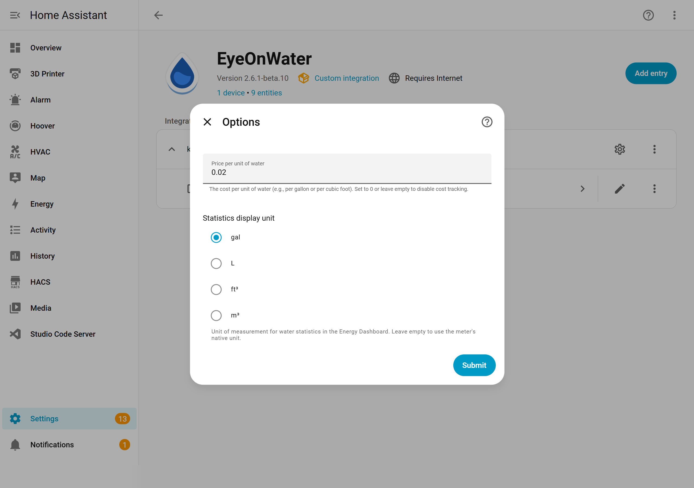

# Water Cost Tracking

The integration can publish **external cost statistics** alongside water usage, letting the Energy Dashboard show both consumption and cost on the same timeline.

## How It Works

- Each imported water data point is multiplied by your configured **unit price** to produce a cumulative cost statistic.
- Cost statistics use the same **hourly granularity** as water usage — they are retroactive and accurate, not real-time estimates.
- The **currency** is set automatically from your HA configuration (`Settings` → `General` → `Currency`).
- Both the regular polling import and the `import_historical_data` service produce cost statistics.

## Setup

1. Go to **Settings** → **Devices & Services** → **EyeOnWater**.
2. Click **Configure** on the integration entry.
3. Enter your **water unit price** — the cost per unit of water.
   - Example: if water costs $5.00 per 1,000 gallons, enter `0.005` (= $5 ÷ 1000).
4. Click **Submit**.

## Adding Cost to the Energy Dashboard

Once configured, a cost statistic appears as `eyeonwater:water_cost_xxxxx`:

1. Go to **Settings** → **Dashboards** → **Energy**.
2. In the **Water Consumption** section, look for the cost field next to your water source.
3. Select `eyeonwater:water_cost_xxxxx`.

## Updating the Price

You can change the unit price at any time through the same **Configure** menu. After updating:

- **Future imports** will use the new price automatically.
- **Past data** retains the old price. To recalculate historical cost with the new price, run the [import_historical_data service](historical-data.md) for the desired time range.

## Example

| Scenario | Unit Price | 1,000 gal used | Cost statistic |
|----------|-----------|-----------------|----------------|
| $5 per 1,000 gal | `0.005` | 1,000 | $5.00 |
| $8 per 1,000 gal | `0.008` | 1,000 | $8.00 |
| $3 per m³ | `3.0` | 1 m³ | $3.00 |
