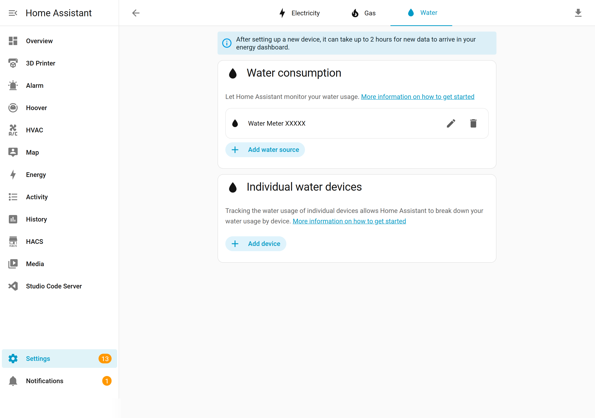
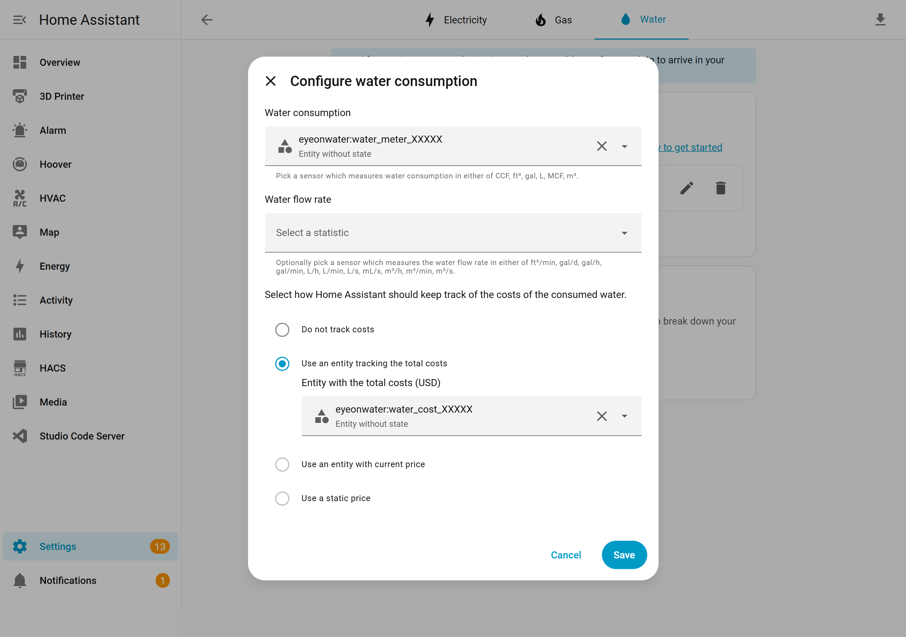

# Energy Dashboard Setup

The EyeOnWater integration provides **external statistics** that integrate directly with Home Assistant's Energy Dashboard for water consumption tracking.

## Adding Water Consumption

1. Go to **Settings** → **Dashboards** → **Energy**.
2. Scroll to the **Water Consumption** section.
3. Click **Add water source**.
4. In the statistic picker, search for and select `eyeonwater:water_meter_xxxxx`.

> **Important:** Select the `eyeonwater:water_meter_xxxxx` statistic — **not** `sensor.water_meter_xxxxx`. The `eyeonwater:` statistic contains accurate hourly data imported from EyeOnWater. The sensor entity is for real-time display only.

## Adding Water Cost (Optional)

If you have configured a [unit price](configuration.md#configuring-water-cost-options-flow), a cost statistic is also available:

1. In the Energy Dashboard configuration, look for a cost option next to your water source.
2. Select `eyeonwater:water_cost_xxxxx`.

The cost statistic uses the same hourly granularity as the water usage data.

## Viewing the Dashboard

Once configured, the Energy Dashboard shows your water consumption over time:

### Data Timing

EyeOnWater publishes meter readings once every few hours, even though the meter itself records data more frequently. This means:

- Data may appear with a **2–6 hour delay** on the dashboard.
- After running the [historical data import](historical-data.md), past data will fill in retroactively.
- The dashboard will show hourly water usage broken down by day, week, or month.

## Next Steps

- [Import Historical Data](historical-data.md) — backfill past water usage
- [Water Cost Tracking](cost-tracking.md) — set up cost statistics
