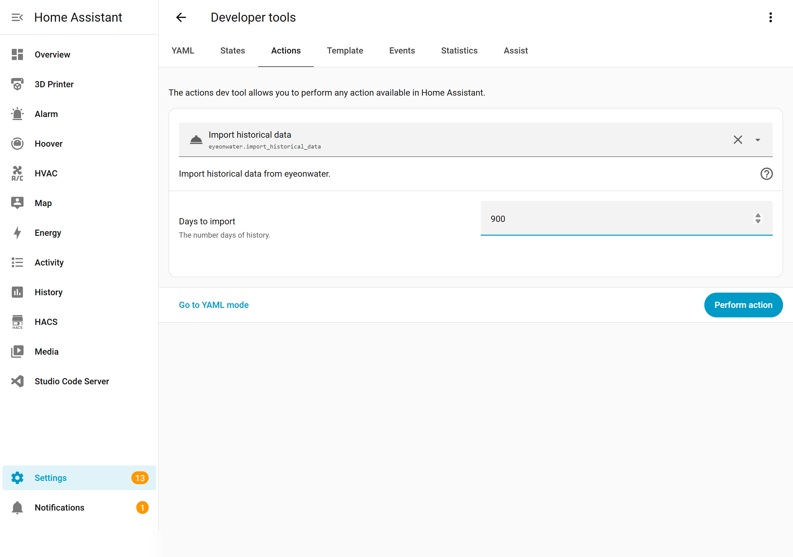

# Historical Data Import & Architecture

## Importing Historical Data

The integration can backfill days, weeks, or months of past water usage after installation. This is especially useful for populating the Energy Dashboard immediately rather than waiting for data to accumulate.

### How to Import

1. Go to **Developer Tools** → **Services**.
2. Select the **EyeOnWater: import_historical_data** service.
3. Set the number of **days** to import (e.g., `365` for a full year).
4. Click **Call Service**.



The import runs in the background. Depending on the number of days, it may take a few minutes. After it completes, the Energy Dashboard will show historical data immediately.

> **Tip:** You can run this service as many times as you want. It is safe to re-import overlapping time ranges — existing data points are updated, not duplicated.

---

## Architecture: How Retroactive Statistics Work

This section explains **why** this integration uses a different approach than most HA sensors, and how it solves the problem of retroactive data.

### The Problem

Most Home Assistant sensors report data in **real time** — the sensor value represents "right now." HA's statistics system is built around this assumption: it samples sensor states periodically and compiles hourly/daily aggregates.

EyeOnWater is different. The water meter records readings constantly, but EyeOnWater's cloud API delivers data **retroactively** — readings for 12 PM–6 PM may only become available at 8 PM. This creates a fundamental conflict:

```
Timeline:
  12:00  13:00  14:00  15:00  16:00  17:00  18:00  19:00  20:00
  ├──────────── Data for this period ───────────┤
                                                        │
                                                  Available here
```

When a sensor with `state_class: total_increasing` imports retroactive data, HA's statistics pipeline interprets the time-shifted readings as negative consumption — because the sum for earlier hours appears to decrease relative to later readings it already compiled.

**Result:** Negative water usage spikes in the Energy Dashboard.

This is discussed upstream: [home-assistant/architecture#964](https://github.com/home-assistant/architecture/discussions/964) — _Delayed data sensors_.

### The Solution: External Statistics

Instead of fighting HA's real-time statistics pipeline, this integration bypasses it entirely using **external statistics** — a separate HA API designed for exactly this use case.

```
┌─────────────────────────────────────────────────┐
│                 EyeOnWater API                  │
│          (retroactive hourly readings)          │
└─────────────────┬───────────────────────────────┘
                  │
                  ▼
┌─────────────────────────────────────────────────┐
│           EyeOnWater Integration                │
│                                                 │
│  ┌───────────────────┐  ┌────────────────────┐  │
│  │   Live Sensor      │  │ External Statistics│  │
│  │   sensor.water_    │  │ eyeonwater:water_  │  │
│  │   meter_xxxxx      │  │ meter_xxxxx        │  │
│  │                    │  │                    │  │
│  │ • Display only     │  │ • Hourly usage     │  │
│  │ • No state_class   │  │ • Retroactive OK   │  │
│  │ • Current reading  │  │ • Energy Dashboard │  │
│  └───────────────────┘  └────────────────────┘  │
│                          ┌────────────────────┐  │
│                          │ Cost Statistics    │  │
│                          │ eyeonwater:water_  │  │
│                          │ cost_xxxxx         │  │
│                          │                    │  │
│                          │ • Hourly cost      │  │
│                          │ • Needs unit price │  │
│                          └────────────────────┘  │
└─────────────────────────────────────────────────┘
```

### How the pieces fit together

| Component | Statistic ID | Purpose |
|-----------|-------------|---------|
| **Live sensor** | `sensor.water_meter_xxxxx` | Real-time meter reading for display in dashboards and automations |
| **Water statistic** | `eyeonwater:water_meter_xxxxx` | Accurate hourly usage for the Energy Dashboard |
| **Cost statistic** | `eyeonwater:water_cost_xxxxx` | Hourly cost data (requires [unit price configuration](configuration.md#configuring-water-cost-options-flow)) |

### Why the live sensor has no `state_class`

The live sensor intentionally has **no `state_class`** attribute. This prevents HA from automatically compiling statistics for it, which would conflict with the external statistics imported from EyeOnWater. All statistics come exclusively from the integration's retroactive imports — no conflicts, no negative values.

### Data flow summary

1. **Every polling cycle** (~30 min): the integration fetches the latest readings from EyeOnWater's API.
2. **New hourly data points** are imported as external statistics under `eyeonwater:water_meter_xxxxx`.
3. If a **unit price** is configured, corresponding cost statistics are imported under `eyeonwater:water_cost_xxxxx`.
4. The **live sensor** is updated with the latest cumulative meter reading.
5. On-demand: the `import_historical_data` service fetches and imports older data in bulk.
