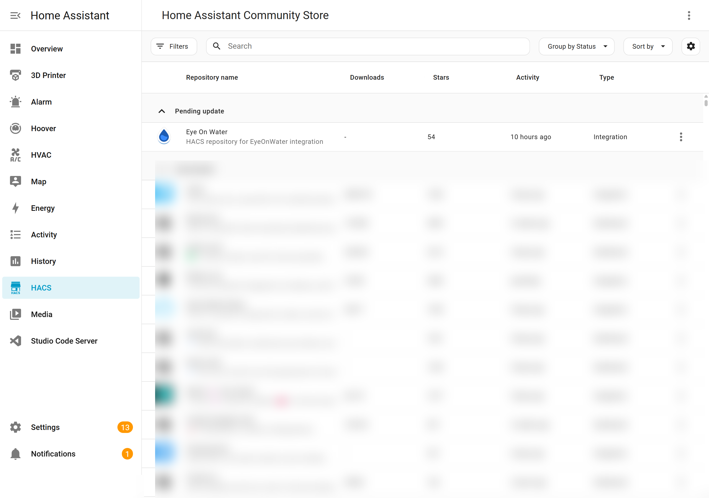

# Installation

## Option 1: Install via HACS (Recommended)

[HACS](https://hacs.xyz/) (Home Assistant Community Store) is the easiest way to install and keep the integration updated.

### Step 1 — Add the custom repository

1. Open HACS in your Home Assistant sidebar.
2. Click the **⋮** (three-dot menu) in the top right corner.
3. Select **Custom repositories**.
4. Paste the repository URL:
   ```
   https://github.com/kdeyev/eyeonwater
   ```
5. Select **Integration** as the category.
6. Click **Add**.



### Step 2 — Download the integration

1. In HACS → **Integrations**, search for **EyeOnWater**.
2. Click on the integration card and then click **Download**.
3. Select the latest version and confirm.

### Step 3 — Restart Home Assistant

Go to **Settings** → **System** → **Restart** and restart Home Assistant.

### Step 4 — Add the integration

1. Go to **Settings** → **Devices & Services**.
2. Click **+ Add Integration**.
3. Search for **EyeOnWater** and select it.
4. Follow the [configuration guide](configuration.md) to enter your credentials.

---

## Option 2: Manual Installation

1. Download the latest release from the [GitHub releases page](https://github.com/kdeyev/eyeonwater/releases).
2. Extract the `custom_components/eyeonwater` folder.
3. Copy it into your Home Assistant `config/custom_components/` directory:
   ```
   config/
   └── custom_components/
       └── eyeonwater/
           ├── __init__.py
           ├── sensor.py
           ├── manifest.json
           └── ...
   ```
4. Restart Home Assistant.
5. Go to **Settings** → **Devices & Services** → **+ Add Integration** → search for **EyeOnWater**.

---

## After Installation

Once installed, continue to the [Configuration guide](configuration.md) to set up your EyeOnWater account.
